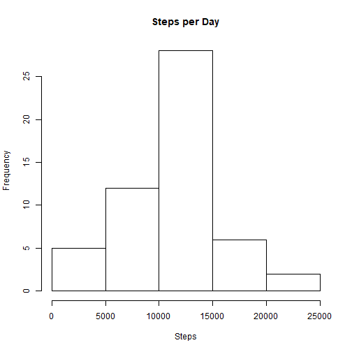
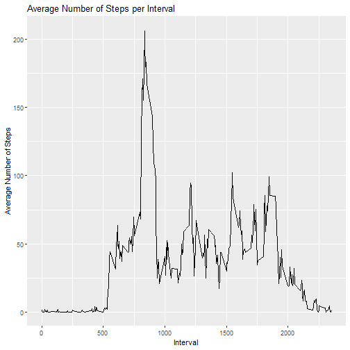
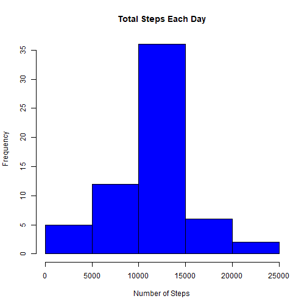

```r
knitr::opts_chunk$set(echo = TRUE)
```

## R Markdown

This is an R Markdown document. Markdown is a simple formatting syntax for authoring HTML, PDF, and MS Word documents. For more details on using R Markdown see <http://rmarkdown.rstudio.com>.

When you click the **Knit** button a document will be generated that includes both content as well as the output of any embedded R code chunks within the document. You can embed an R code chunk like this:


```r
library(ggplot2)
```

```
## Warning: package 'ggplot2' was built under R version 3.5.1
```

```r
library(plyr)
```

```
## Warning: package 'plyr' was built under R version 3.5.1
```

```r
library(dplyr)
```

```
## Warning: package 'dplyr' was built under R version 3.5.1
```

```
## 
## Attaching package: 'dplyr'
```

```
## The following objects are masked from 'package:plyr':
## 
##     arrange, count, desc, failwith, id, mutate, rename, summarise,
##     summarize
```

```
## The following objects are masked from 'package:stats':
## 
##     filter, lag
```

```
## The following objects are masked from 'package:base':
## 
##     intersect, setdiff, setequal, union
```

```r
activity<-read.csv("c:/coursera_Data/activity.csv")
```
histogram of steps per day

```r
sumTable <- aggregate(activity$steps ~ activity$date, FUN=sum, )
colnames(sumTable)<- c("Date", "Steps")
hist(sumTable$Steps, breaks=5, xlab="Steps", main = "Steps per Day")
```


calculate mean and median

```r
mean(sumTable$Steps,na.rm=TRUE)
```

```
## [1] 10766.19
```

```r
median(sumTable$Steps,na.rm=TRUE)
```

```
## [1] 10765
```
average daily active pattern

```r
intervalTable <- ddply(activity[!is.na(activity$steps),], .(interval), summarize, Avg = mean(steps))
p<-ggplot(intervalTable, aes(x=interval, y=Avg), xlab = "Interval", ylab="Average Number of Steps")
p + geom_line()+xlab("Interval")+ylab("Average Number of Steps")+ggtitle("Average Number of Steps per Interval")
```


which 5 minute interval contains the maxium number of steps

```r
intervalTable[intervalTable$Avg==max(intervalTable$Avg),1]
```

```
## [1] 835
```

imputing missing values


```r
nrow(activity[is.na(activity$steps),])
```

```
## [1] 2304
```

```r
steps_by_interval <- aggregate(steps ~ interval,activity, mean)
incomplete <- sum(!complete.cases(activity))
imputed_data <- transform(activity, steps = ifelse(is.na(activity$steps), steps_by_interval$steps[match(activity$interval, steps_by_interval$interval)], activity$steps))

steps_by_day_i <- aggregate(steps ~ date, imputed_data, sum)
hist(steps_by_day_i$steps, main = paste("Total Steps Each Day"), col="blue", xlab="Number of Steps")
```


